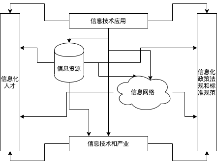
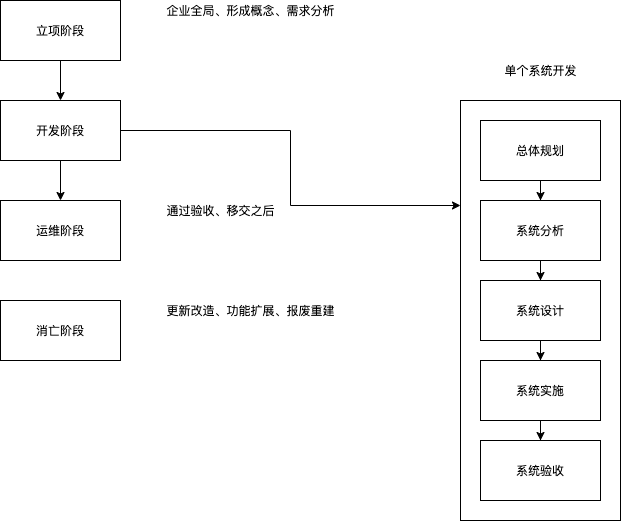
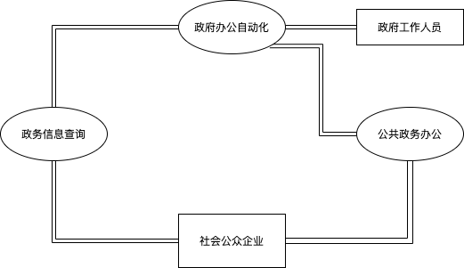

# 企业信息化战略与实施

## 信息与信息化的概念

* 信息的定义
    * 香农：信息就是不确定性的减少。
    * 维纳：信息就是信息，既不是物质，也不是能量

* 信息的特点
    * 客观性（真伪性）：也叫事实性，不符合事实的信息不仅没价值，还有副作用。
    * 动态性：信息随着时间的变化而变化。
    * 层次性：信息可分为战略级，管理级和操作级。
    * 传递性：信息在时间上的传递即是存储，在空间上的传递即是转移或扩散。
    * 滞后性：信息是数据加工后的产物，所以相对数据有滞后性。
    * 扩压性：信息和实物不同，它可以扩散也可以压缩。
    * 分享性：信息可以分享，这和物质不同，并且信息分享具有非零和性。

* 信息化的概念
  * 信息化是从工业社会到信息社会的演进与交替。
  * 信息化的主体是全体社会成员（政府、企业、团体和个人），时域就是一个长期过程，空域是经济和社会的一切领域，手段是先进社会生产工具。

* 信息化对组织的意义
  * 组织结构创新：如虚拟企业、虚拟社交。
  * 组织管理创新：实施电子政务，建立电子政府，建立电子社区以提升管理水平。
  * 组织经营创新：利用信息化将经营和管理融为一体。
  * 早就信息化的人才队伍：三类人才（IT专业人才，业务人才，专家型人才）

* 信息化标准、法律和规定

## 信息系统的概念
## 信息系统的类型
## 信息系统战略规划
### 信息系统的战略规划 - 方法

* 第一阶段：**以数据处理为核心**，围绕职能部分需求
  * 企业系统规划法（BSP）：自上而下识别系统目标，自下而上设计信息系统，对组织机构的变动具有适应性。(提出了U/C矩阵，Use Create，哪些功能使用哪些数据、哪些功能建立哪些数据)。
  * 关键成功因素法（CSF）：找实现目标的关键信息集合，从而确定开发优先次序。
  * 战略集合转化法（SST）：把战略目标看成“信息集合”，把战略目标转变成信息系统的战略目标。
* 第二阶段：**以企业内部MIS为核心**，围绕企业整体需求。
  * 战略数据规划法（SDP）（考虑数据全局性）、信息工程法（IE）、战略栅格法（SG）。
* 第三阶段：综合考虑企业内外环境，**以集成为核心**，围绕企业战略需求。
  * 价值链分析法（VCA）、战略一致性模型（SAM）。

## 信息系统的声明周期

* 系统规划
  * 初步调查、分析系统目标、子系统组成、拟实施方案、可行性研究、制定系统建设方案。
  * 系统设计任务书(系统建设方案、实施计划)

* 系统分析
  * 业务流程分析、数据与数据流程分析、软件需求分析、网络需求分析。
  * 系统需求规格说明、软件需求规格说明书、确认测试计划、系统测试计划、初步的用户手册。

* 系统设计
  * 软件架构设计、软件概要设计、详细设计、网络设计
  * 架构设计文档、概要设计说明书、详细设计说明书、程序规格说明书、概要测试计划、详细测试计划、各类设计图

* 系统实施
  * 软件编码、软件单元/集成/系统测试、综合布线
  * 源码、单元测试、集成测试报告、操作手册

* 系统验收
  * 确认测试、试运行
  * 确认测试报告、项目验收报告

## 政府信息化与电子政务

* 政府对政府 G2G (Government To Government)
* 政府对企业 G2B或B2G (Government To Business)
* 政府对公民 G2C或C2G (Government To Citizen)
* 政府对公务员 G2E (Government To Employee)

## 企业资源计划（ERP）
* 演变历史
  * 物料需求计划 MRP Material Requirement Planning
    * 物料单系统
  * 制造资源计划 MRPII manufacuring resourxe planning II
    * 增加库存、分销等
  * 企业资源计划 ERP enterprise resource planning
    * 打通了供应链，把财务、人力资源、销售管理等纳入。
* 管理思想：它是思想的变革。
* 软件产品：但不是直接买来就用，需要个性化的开发与部署
* 管理系统：存在众多的子系统，这些子系统有统一的规划，是互联互通的，便于事前事中监控。
* 众多的子系统
  * 财务管理
    * 会计核算
    * 财务管理
  * 生产控制管理
    * 主生产计划
    * 物料需求计划
    * 能力需求计划
    * 车间控制
    * 制造标准
  * 人力资源管理
    * 人力资源规划
    * 招聘管理
    * 工资核算
    * 工时管理
    * 差旅费核算
  * 物流管理
    * 分销管理
    * 库存控制
    * 采购管理

## 客户关系管理（CRM）
## 供应链管理（SCM）
## 商业智能（BI）
## 电子数据交换（EDI）
## 企业应用集成
## 电子商务
## AI
## 区块链