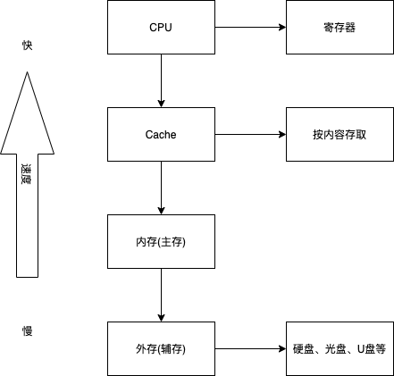

# 计算机组成原理与体系结构
考察分值 round 5 score.

## Flynn分类法

分类依据两个指标：
* 指令流
* 数据流

按照体系结构类型有如下区别：
* 单指令流单数据流SISD
  * 结构：控制部分一个，处理器一个，主存模块一个
  * 关键特性：
  * 代表：单处理器系统(386,486,586)
* 单指令流多数据流SIMD
  * 结构：控制部分一个，处理器多个，主存模块多个
  * 关键特性：各处理器以异步的形式执行同一条指令
  * 代表：并行处理机，阵列处理机，超级向量处理机
* 多指令流单数据流MISD
  * 结构：控制部分多个，处理器一个，主存模块多个
  * 关键特性：被证明不可能，至少是不实际
  * 代表：目前没有，有文献称流水线计算机为此类
* 多指令流多数据流MIMD
  * 结构：控制部分多个，处理器多个，主存模块多个
  * 关键特性：能够实现作业、任务、指令等各级全面并行
  * 代表：多处理机系统，多计算机

### CISC和RISC

* CISC 复杂(根据不同的用户做不同的指令)
  * 指令：数量多，使用频率差别大，可变长格式。
  * 寻址方式：支持多种
  * 实现方式：微程序控制技术（微码）
  * 其它：研制周期长 
* RISC 简单
  * 指令：数量少，使用频率接近，定长格式，大部分为单周期指令，操作寄存器(为提升效率)，只有Load/Store操作内存
  * 寻址方式：支持方式少
  * 实现方式：增加了通用寄存器，硬布线逻辑控制为主，适合采用流水线
  * 其它：优化编译，有效支持高级语言。

### 计算机层次化存储结构



CPU读取数据先从Cache中获取，若获取不到，再从寄存器中获取。(Cache 的命中率很关键)

### Cache的基本概念
* Cache的功能：提高CPU数据输入输出的速率，突破冯诺依曼瓶颈，即CPU与存储系统间数据传送带宽限制。
* 在计算机的存储体系中，Cache是访问速度最快的层次。
* 使用Cache改善系统性能的依据是程序的局部性原理。

如果以h代表对Cache的访问命中率，t1表示Cache的周期时间，t2表示主存储器周期时间，以读操作为例，使用Cache主存储器的系统平均周期为t3，则
    t3=h*t1+(1-h)*t2
其中，1-h又称为失效率(未命中率)。

### 时间局部性与空间局部性

计算机在处理相关的数据和程序的时候，某些时段集中访问/读取某些数据。


demo
```c
int i,s=0;
for(i=1;i<1000;i++){
    for(j=1;j<1000;j++){
        s+=j;
    }
}
printf("result is %d",s);
```

时间局部性
空间局部性
工作集理论：工作集是进程运行时间被频繁访问的页面集合。

里面的循环 100w次，s的数据在cache中，刚刚访问完，再次访问，读取高效，是时间局部性。

例如数组a中，访问了a0，又临近访问a1，访问a0时临近的数据a1其实已被取入Cache中，这就是空间的局限性。

### 随机存储器与只读存储器

随机存储器
* DRAM (Dynamic RAM，动态RAM) - SDRAM
* SRAM (Static RAM，静态RAM)

只读存储器
* MROM (Mask ROM 掩模式ROM)
* PROM (Programmable ROM，一次可编程ROM)
* EPROM (Erasable PROM，可擦除的PROM)
* 闪速存储器 (flash memory 闪存)

### 磁盘工作原理

### 流水线的基本概念

#### 流水线周期及流水线执行时间计算

#### 流水线吞吐率计算

#### 流水线加速比计算
